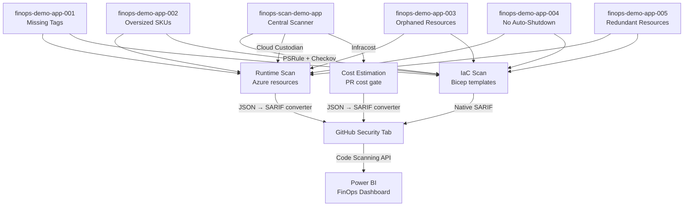

## Architecture



## Tool Stack

| Layer | Tool | Focus | SARIF Output | License |
| ------- | ------ | ------- | -------------- | --------- |
| IaC Governance | PSRule for Azure | WAF Cost Optimization rules on Bicep/ARM | Native | MIT |
| IaC Security+Cost | Checkov | 1,000+ multi-cloud IaC policies | Native | Apache 2.0 |
| Runtime Cost Governance | Cloud Custodian | Orphans, tagging, right-sizing on live resources | Converted | Apache 2.0 |
| Cost Estimation | Infracost | Pre-deployment cost estimates from IaC | Converted | Apache 2.0 |

## Demo App Repos

| Repo | FinOps Violation | Key Azure Resources | Est. Monthly Cost |
| ------ | ----------------- | --------------------- | ------------------- |
| `finops-demo-app-001` | Missing required tags | Storage + App Service + Web App — zero tags | ~$15 |
| `finops-demo-app-002` | Oversized resources | P3v3 App Service Plan + Premium storage for dev | ~$800 |
| `finops-demo-app-003` | Orphaned resources | Unattached Public IP + NIC + Managed Disk + NSG | ~$30 |
| `finops-demo-app-004` | No auto-shutdown | D4s_v5 VM running 24/7 without shutdown schedule | ~$140 |
| `finops-demo-app-005` | Redundant/expensive resources | Duplicate plans in expensive regions + GRS storage | ~$200 |

## Prerequisites

- [Azure CLI](https://learn.microsoft.com/cli/azure/install-azure-cli) v2.50+
- [GitHub CLI](https://cli.github.com/) v2.40+
- [PowerShell 7](https://learn.microsoft.com/powershell/scripting/install/installing-powershell) v7.3+
- Azure subscription with Contributor access
- GitHub organization admin access to `devopsabcs-engineering`
- [Infracost](https://www.infracost.io/docs/) API key (free tier available — see [Secrets Configuration](#secrets-configuration))

## Secrets Configuration

### Infracost API Key

The Infracost API key is required for the PR cost gate workflow (`finops-cost-gate.yml`) to estimate infrastructure costs from Bicep templates. The free tier supports up to 1,000 cost estimates per month.

**Option A: CLI login (recommended)**

```bash
# Install Infracost CLI
# macOS/Linux:
curl -fsSL https://raw.githubusercontent.com/infracost/infracost/master/scripts/install.sh | sh
# Windows (winget):
winget install Infracost.Infracost

# Authenticate — opens browser to sign in and saves the key locally
infracost auth login

# Retrieve your API key
infracost configure get api_key
```

**Option B: Infracost Cloud dashboard**

1. Sign up at [infracost.io/pricing](https://www.infracost.io/pricing/) (free tier available).
2. Navigate to **Org Settings > API Keys** in the Infracost Cloud dashboard.
3. Copy the API key.

**Configure as GitHub secret:**

```powershell
# Set the secret on the scanner repo
gh secret set INFRACOST_API_KEY --repo devopsabcs-engineering/finops-scan-demo-app --body "<your-api-key>"
```

The bootstrap script (`scripts/bootstrap-demo-apps.ps1`) prompts for this value and configures it automatically.

### OIDC Secrets (Azure)

The following secrets are required on each demo app repo for Azure deployments via OIDC federation:

| Secret | Description | Source |
| ------ | ----------- | ------ |
| `AZURE_CLIENT_ID` | Azure AD app registration client ID | `scripts/setup-oidc.ps1` output |
| `AZURE_TENANT_ID` | Azure AD tenant ID | Azure portal or `az account show` |
| `AZURE_SUBSCRIPTION_ID` | Target Azure subscription ID | Azure portal or `az account show` |

Run `scripts/setup-oidc.ps1` to create the Azure AD app registration and federated credential, then use the bootstrap script to set these secrets on all repos.

### Cross-Repo Access (`ORG_ADMIN_TOKEN`)

The scanner repo needs a GitHub Personal Access Token (classic) to reach into the 5 demo app repos. The demo app repos themselves do **not** need this token.

| Secret | Scopes Required | Set On |
| ------ | --------------- | ------ |
| `ORG_ADMIN_TOKEN` | `repo`, `workflow`, `security_events` | `finops-scan-demo-app` only |

**What uses it:**

- `finops-scan.yml` — checks out demo app repos and uploads SARIF to their Security tabs
- `deploy-all.yml` — triggers `deploy.yml` in each demo app repo
- `teardown-all.yml` — triggers `teardown.yml` in each demo app repo

**How to create it:**

1. Go to [github.com/settings/tokens](https://github.com/settings/tokens) → **Generate new token (classic)**.
2. Set a note (e.g., `finops-scanner-org-admin-token`) and expiration (90 days recommended).
3. Select these scopes: **repo**, **workflow**, **security_events**.
4. Click **Generate token** and copy it immediately.
5. Save it as a secret on the scanner repo:

```powershell
gh secret set ORG_ADMIN_TOKEN --repo devopsabcs-engineering/finops-scan-demo-app
# Paste the token when prompted
```

## Quick Start

### 1. Bootstrap demo app repos

```powershell
./scripts/bootstrap-demo-apps.ps1
```

### 2. Deploy all demo apps

```powershell
# Deploy all 5 demo apps to Azure (via GitHub Actions)
gh workflow run deploy-all.yml
```

### 3. Run FinOps scan

```powershell
# Trigger the centralized FinOps scan
gh workflow run finops-scan.yml
```

### 4. Teardown all demo apps

```powershell
# Remove all Azure resources
gh workflow run teardown-all.yml
```

## Project Structure

```text
finops-scan-demo-app/
├── .github/
│   ├── agents/                      # FinOps Copilot agent definitions
│   ├── instructions/                # Governance and workflow rules
│   ├── skills/                      # Domain knowledge for agents
│   ├── prompts/                     # Reusable prompt templates
│   └── workflows/                   # GitHub Actions CI/CD pipelines
├── src/
│   ├── converters/                  # SARIF converter scripts
│   │   ├── custodian-to-sarif.py    # Cloud Custodian JSON → SARIF
│   │   └── infracost-to-sarif.py    # Infracost JSON → SARIF
│   └── config/
│       ├── ps-rule.yaml             # PSRule configuration
│       ├── .checkov.yaml            # Checkov configuration
│       └── custodian/               # Cloud Custodian policies
├── infra/                           # Scanner infrastructure (optional)
├── scripts/
│   └── bootstrap-demo-apps.ps1      # Create 5 demo app repos
├── docs/                            # Documentation
└── README.md
```

## Agentic Framework Integration

This project integrates with the [Agentic Accelerator Framework](https://github.com/devopsabcs-engineering/agentic-accelerator-framework) providing 5 specialized FinOps agents:

| Agent | Purpose |
| ------- | --------- |
| CostAnalysisAgent | Analyzes Azure resource costs and identifies optimization opportunities |
| FinOpsGovernanceAgent | Enforces FinOps governance policies and validates tagging compliance |
| CostAnomalyDetector | Detects unusual spending patterns and identifies cost spikes |
| CostOptimizerAgent | Recommends resource right-sizing and suggests alternative SKUs |
| DeploymentCostGateAgent | Gates deployments on cost thresholds and reviews PR cost impact |

## Related Resources

- [FinOps Foundation FOCUS Specification](https://focus.finops.org/)
- [Azure Well-Architected Framework — Cost Optimization](https://learn.microsoft.com/azure/well-architected/cost-optimization/)
- [Microsoft FinOps Toolkit](https://github.com/microsoft/finops-toolkit)
- [PSRule for Azure](https://github.com/Azure/PSRule.Rules.Azure)
- [Checkov](https://github.com/bridgecrewio/checkov)
- [Cloud Custodian](https://github.com/cloud-custodian/cloud-custodian)
- [Infracost](https://github.com/infracost/infracost)
