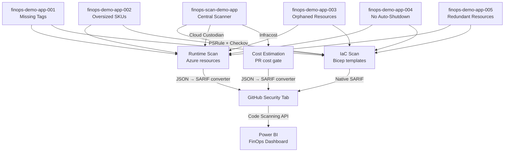

## Architecture



## Tool Stack

| Layer | Tool | Focus | SARIF Output | License |
| ------- | ------ | ------- | -------------- | --------- |
| IaC Governance | PSRule for Azure | WAF Cost Optimization rules on Bicep/ARM | Native | MIT |
| IaC Security+Cost | Checkov | 1,000+ multi-cloud IaC policies | Native | Apache 2.0 |
| Runtime Cost Governance | Cloud Custodian | Orphans, tagging, right-sizing on live resources | Converted | Apache 2.0 |
| Cost Estimation | Infracost | Pre-deployment cost estimates from IaC | Converted | Apache 2.0 |

## Demo App Repos

Each demo app is deployed to `canadacentral` in its own resource group (`rg-finops-demo-NNN`). All resources have intentional FinOps violations that the scanner detects.

| Repo | FinOps Violation | Key Azure Resources | Scan Findings |
| ------ | ----------------- | --------------------- | ------------- |
| [finops-demo-app-001](https://github.com/devopsabcs-engineering/finops-demo-app-001) | Missing required tags | Storage + App Service (B1) + Web App — zero tags | PSRule: 19, Checkov: 14, Custodian: 1 |
| [finops-demo-app-002](https://github.com/devopsabcs-engineering/finops-demo-app-002) | Oversized resources | P3v3 App Service Plan + Premium storage for dev | PSRule: 14, Checkov: 14, Custodian: 2 |
| [finops-demo-app-003](https://github.com/devopsabcs-engineering/finops-demo-app-003) | Orphaned resources | Unattached Public IP + NIC + Managed Disk + NSG | PSRule: 4, Checkov: 3, Custodian: 4 |
| [finops-demo-app-004](https://github.com/devopsabcs-engineering/finops-demo-app-004) | No auto-shutdown | D4s_v5 VM running 24/7 without shutdown schedule | Checkov: 7, Custodian: 3 |
| [finops-demo-app-005](https://github.com/devopsabcs-engineering/finops-demo-app-005) | Redundant/expensive | Duplicate plans in westeurope/southeastasia + GRS | PSRule: 27, Checkov: 23, Custodian: 2 |

## Prerequisites

- [Azure CLI](https://learn.microsoft.com/cli/azure/install-azure-cli) v2.50+
- [GitHub CLI](https://cli.github.com/) v2.40+
- [PowerShell 7](https://learn.microsoft.com/powershell/scripting/install/installing-powershell) v7.3+
- Azure subscription with Contributor access
- GitHub organization admin access to `devopsabcs-engineering`
- [Infracost](https://www.infracost.io/docs/) API key (free tier available — see [Secrets Configuration](#secrets-configuration))

## Secrets Configuration

### Infracost API Key

The Infracost API key is required for the PR cost gate workflow (`finops-cost-gate.yml`) to estimate infrastructure costs from Bicep templates. The free tier supports up to 1,000 cost estimates per month.

**Option A: CLI login (recommended)**

```bash
# Install Infracost CLI
# macOS/Linux:
curl -fsSL https://raw.githubusercontent.com/infracost/infracost/master/scripts/install.sh | sh
# Windows (winget):
winget install Infracost.Infracost

# Authenticate — opens browser to sign in and saves the key locally
infracost auth login

# Retrieve your API key
infracost configure get api_key
```

**Option B: Infracost Cloud dashboard**

1. Sign up at [infracost.io/pricing](https://www.infracost.io/pricing/) (free tier available).
2. Navigate to **Org Settings > API Keys** in the Infracost Cloud dashboard.
3. Copy the API key.

**Configure as GitHub secret:**

```powershell
# Set the secret on the scanner repo
gh secret set INFRACOST_API_KEY --repo devopsabcs-engineering/finops-scan-demo-app --body "<your-api-key>"
```

The bootstrap script (`scripts/bootstrap-demo-apps.ps1`) prompts for this value and configures it automatically.

### OIDC Secrets (Azure)

The following secrets are required on each demo app repo for Azure deployments via OIDC federation:

| Secret | Description | Source |
| ------ | ----------- | ------ |
| `AZURE_CLIENT_ID` | Azure AD app registration client ID | `scripts/setup-oidc.ps1` output |
| `AZURE_TENANT_ID` | Azure AD tenant ID | Azure portal or `az account show` |
| `AZURE_SUBSCRIPTION_ID` | Target Azure subscription ID | Azure portal or `az account show` |

**Important:** Azure AD requires a separate federated identity credential for each repo that uses OIDC login. The `setup-oidc.ps1` script creates federated credentials for all 6 repos (scanner + 5 demo apps) and assigns the Contributor role on the subscription:

```powershell
# Run once after creating the Azure AD app registration
./scripts/setup-oidc.ps1
```

Then use the bootstrap script to set the secret values on all demo app repos:

```powershell
./scripts/bootstrap-demo-apps.ps1
```

### Cross-Repo Access (`ORG_ADMIN_TOKEN`)

A GitHub Personal Access Token (classic) is needed for cross-repo operations.

| Secret | Scopes Required | Set On |
| ------ | --------------- | ------ |
| `ORG_ADMIN_TOKEN` | `repo`, `workflow`, `security_events` | Scanner repo + all 5 demo repos |

**What uses it on the scanner repo:**

- `finops-scan.yml` — checks out demo app repos and uploads SARIF to their Security tabs via REST API
- `deploy-all.yml` — triggers `deploy.yml` in each demo app repo and monitors completion
- `teardown-all.yml` — triggers `teardown.yml` in each demo app repo

**What uses it on each demo app repo:**

- `deploy.yml` — pushes deployment screenshots and status to the repo wiki

**How to create it:**

1. Go to [github.com/settings/tokens](https://github.com/settings/tokens) → **Generate new token (classic)**.
2. Set a note (e.g., `finops-scanner-org-admin-token`) and expiration (90 days recommended).
3. Select these scopes: **repo**, **workflow**, **security_events**.
4. Click **Generate token** and copy it immediately.
5. The bootstrap script sets this secret on all repos automatically when you provide it.

### VM Admin Password (App 004)

| Secret | Description | Set On |
| ------ | ----------- | ------ |
| `VM_ADMIN_PASSWORD` | Password for the D4s_v5 VM (12+ chars, upper/lower/number/special) | `finops-demo-app-004` only |

The bootstrap script prompts for this with a suggested default (`F1nOps#Demo2026!`).

## Quick Start

### 1. Set up Azure OIDC federation

Creates the Azure AD app registration with federated credentials for all 6 repos and assigns Contributor role:

```powershell
az login --tenant <your-tenant-id>
./scripts/setup-oidc.ps1
```

### 2. Bootstrap demo app repos

Creates repos, pushes demo app content, sets secrets (OIDC, ORG_ADMIN_TOKEN, VM password), enables wikis:

```powershell
./scripts/bootstrap-demo-apps.ps1
```

The script prompts for `AZURE_CLIENT_ID`, `ORG_ADMIN_TOKEN`, and `VM_ADMIN_PASSWORD`. All prompts support environment variables for non-interactive use.

### 3. Initialize wikis (one-time manual step)

GitHub requires the first wiki page to be created via the web UI. Click each link and save the default page:

- [finops-scan-demo-app wiki](https://github.com/devopsabcs-engineering/finops-scan-demo-app/wiki/_new)
- [finops-demo-app-001 wiki](https://github.com/devopsabcs-engineering/finops-demo-app-001/wiki/_new)
- [finops-demo-app-002 wiki](https://github.com/devopsabcs-engineering/finops-demo-app-002/wiki/_new)
- [finops-demo-app-003 wiki](https://github.com/devopsabcs-engineering/finops-demo-app-003/wiki/_new)
- [finops-demo-app-004 wiki](https://github.com/devopsabcs-engineering/finops-demo-app-004/wiki/_new)
- [finops-demo-app-005 wiki](https://github.com/devopsabcs-engineering/finops-demo-app-005/wiki/_new)

After initialization, deploy workflows automatically update each wiki with deployment screenshots.

### 4. Deploy all demo apps

```powershell
gh workflow run deploy-all.yml --repo devopsabcs-engineering/finops-scan-demo-app
```

Deploys all 5 apps sequentially to Azure (`canadacentral`), waits for each to complete, and updates the scanner wiki with a central deployment status page linking to each app's wiki.

### 5. Run FinOps scan

```powershell
gh workflow run finops-scan.yml --repo devopsabcs-engineering/finops-scan-demo-app
```

Runs PSRule (IaC), Checkov (IaC), and Cloud Custodian (runtime) against all 5 demo apps. Results are uploaded as SARIF to each demo app's Security tab via the GitHub REST API.

### 6. Teardown all demo apps

```powershell
gh workflow run teardown-all.yml --repo devopsabcs-engineering/finops-scan-demo-app
```

Requires manual approval via the `production` environment protection rule before deleting resource groups.

## Project Structure

```text
finops-scan-demo-app/
├── .github/
│   ├── agents/                      # 5 FinOps Copilot agent definitions
│   ├── instructions/                # Governance and workflow rules
│   │   ├── ado-workflow.instructions.md
│   │   └── finops-governance.instructions.md
│   ├── skills/finops-scan/          # Scanner tool knowledge skill
│   ├── prompts/                     # finops-scan and finops-fix prompts
│   └── workflows/
│       ├── finops-scan.yml          # Central scan (PSRule+Checkov+Custodian)
│       ├── finops-cost-gate.yml     # PR cost gate (Infracost)
│       ├── deploy-all.yml           # Deploy all 5 demo apps
│       └── teardown-all.yml         # Teardown all 5 demo apps
├── src/
│   ├── converters/
│   │   ├── custodian-to-sarif.py    # Cloud Custodian → SARIF (with RG filter)
│   │   └── infracost-to-sarif.py    # Infracost → SARIF
│   └── config/
│       ├── ps-rule.yaml             # PSRule (Bicep expansion, GA baseline)
│       ├── .checkov.yaml            # Checkov (Bicep/ARM framework)
│       ├── infracost.yml            # Infracost project config
│       └── custodian/               # Cloud Custodian policies
│           ├── orphan-detection.yml
│           ├── tagging-compliance.yml
│           ├── right-sizing.yml
│           └── idle-resources.yml
├── scripts/
│   ├── bootstrap-demo-apps.ps1      # Create repos, push content, set secrets
│   └── setup-oidc.ps1               # Azure AD OIDC federation (6 repos)
├── finops-demo-app-001/             # Demo app source (Missing Tags)
├── finops-demo-app-002/             # Demo app source (Oversized Resources)
├── finops-demo-app-003/             # Demo app source (Orphaned Resources)
├── finops-demo-app-004/             # Demo app source (No Auto-Shutdown)
├── finops-demo-app-005/             # Demo app source (Redundant/Expensive)
├── docs/                            # Power BI data model + dashboard docs
└── README.md
```

## Agentic Framework Integration

This project integrates with the [Agentic Accelerator Framework](https://github.com/devopsabcs-engineering/agentic-accelerator-framework) providing 5 specialized FinOps agents:

| Agent | Purpose |
| ------- | --------- |
| CostAnalysisAgent | Analyzes Azure resource costs and identifies optimization opportunities |
| FinOpsGovernanceAgent | Enforces FinOps governance policies and validates tagging compliance |
| CostAnomalyDetector | Detects unusual spending patterns and identifies cost spikes |
| CostOptimizerAgent | Recommends resource right-sizing and suggests alternative SKUs |
| DeploymentCostGateAgent | Gates deployments on cost thresholds and reviews PR cost impact |

## Scanning Pipeline

The `finops-scan.yml` workflow runs weekly (Monday 06:00 UTC) or on demand. It scans all 5 demo apps in parallel using a matrix strategy:

1. **PSRule** — Checks out each demo app's Bicep templates, expands them to ARM JSON (`AZURE_BICEP_FILE_EXPANSION`), and applies the `Azure.GA_2024_12` baseline. Produces native SARIF.
2. **Checkov** — Scans Bicep templates for 1,000+ IaC security and cost policies. Produces native SARIF.
3. **Cloud Custodian** — Scans live Azure resources via OIDC authentication. Runs 4 policy files (orphan detection, tagging compliance, right-sizing, idle resources) against the subscription. The `custodian-to-sarif.py` converter filters results by resource group (`--resource-group rg-finops-demo-{NNN}`) so each app only gets its own findings.
4. **Cross-repo upload** — Collects SARIF artifacts from all 3 tools and uploads them to each demo app's Security tab via the GitHub Code Scanning REST API.

## Deployment Features

Each demo app's `deploy.yml` workflow includes:

- **Azure OIDC login** — Passwordless authentication via federated identity credentials
- **Bicep deployment** — Creates resource group and deploys IaC template
- **Static content deploy** — Zip deploys `src/index.html` to web apps (apps 001, 002, 005)
- **Job summary** — Writes clickable deployment URL to the GitHub Actions summary
- **Playwright screenshot** — Captures the deployed web app (apps 001, 002, 005)
- **Wiki update** — Pushes deployment status and screenshot to the repo wiki (continues on error if wiki not initialized)

The central `deploy-all.yml` workflow triggers all 5 deploys sequentially, waits for each to complete, and updates the scanner wiki with a consolidated status page.

## Wiki Pages

Each demo app wiki has a **Deployment** page (auto-updated by the deploy workflow) showing:

- Latest deployment build number and date
- Clickable site URL
- Link to the workflow run
- Deployment screenshot

The scanner repo wiki has a **Deployments** page with a status table linking to all 5 demo app wikis.

> **Note:** GitHub wikis must be initialized once via the web UI before workflows can push to them. See [Quick Start step 3](#3-initialize-wikis-one-time-manual-step).

## Related Resources

- [FinOps Foundation FOCUS Specification](https://focus.finops.org/)
- [Azure Well-Architected Framework — Cost Optimization](https://learn.microsoft.com/azure/well-architected/cost-optimization/)
- [Microsoft FinOps Toolkit](https://github.com/microsoft/finops-toolkit)
- [PSRule for Azure](https://github.com/Azure/PSRule.Rules.Azure)
- [Checkov](https://github.com/bridgecrewio/checkov)
- [Cloud Custodian](https://github.com/cloud-custodian/cloud-custodian)
- [Infracost](https://github.com/infracost/infracost)
